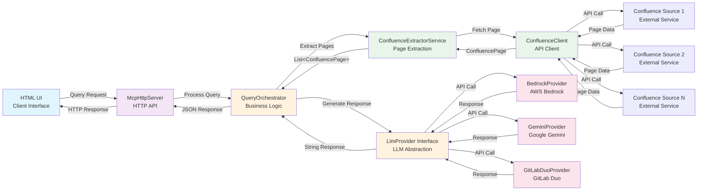
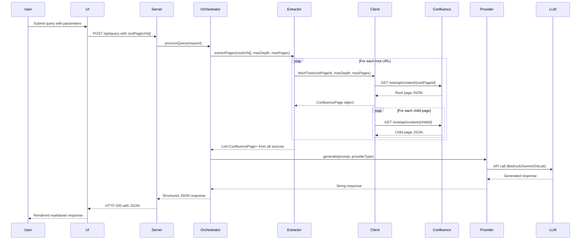

# MCP Confluence RAG (Java + HTML)

This project implements the workflow from `plan.md`:
- HTML UI as MCP client
- Local Java MCP server
- Confluence extraction from a root page and all child pages
- LLM response generation via Bedrock or Gemini
- Final response returned to UI

## Root page target
Default root URL:
`https://akshatanand.atlassian.net/wiki/spaces/~5e80e683cb85aa0c1448bd0f/pages/327681/Software+architecture+review`

The server extracts `pageId=327681` and traverses child pages recursively.

## Architecture Overview

### System Architecture


### Data Flow


## Prerequisites
- Java 17+
- Maven 3.9+
- Confluence API token
- Bedrock credentials (if using Bedrock) or Gemini API key (if using Gemini)

## Configure environment
Set values in `.env.example`, then load them into your shell before running.

Required variables:
- `CONFLUENCE_BASE_URL`
- `CONFLUENCE_EMAIL`
- `CONFLUENCE_API_TOKEN`

Provider-specific:
- Bedrock: `AWS_REGION`, `BEDROCK_MODEL_ID`
- Gemini: `GEMINI_API_KEY`, optional `GEMINI_MODEL`

## Run
1) Move to project directory:
```bash
cd "/Users/Admin/Developer/Side projects/RAG"
```

2) Load environment variables:
```bash
set -a
source .env.example
set +a
```

3) Start server:
```bash
mvn clean compile exec:java
```

Open:
- `http://localhost:8080`

overall command 

```
cd '/Users/Admin/Developer/Side projects/RAG' && set -a && source .env.example && set +a && mvn clean compile exec:java
```

Stop server:
- In the same terminal: `Ctrl + C`

How to the kill the process

Kill all Java processes:
pkill -f java
See Java processes first, then kill specific PID:
ps aux | grep [j]ava
kill -9 <PID>
For your port-specific server (recommended):

Find process using port 8080:
lsof -i :8080
Kill only that process:
kill -9 $(lsof -ti :8080)
Then restart project:

cd "/Users/Admin/Developer/Side projects/RAG"
set -a && source [.env.example](http://_vscodecontentref_/1) && set +a
mvn clean compile exec:java
If you want, I can run the exact kill + restart commands for you now.

UI actions:
- `Run Query`: usual process (Confluence extraction + LLM via `bedrock` or `gemini`)
- `Extract Only`: Confluence extraction only (no LLM call)
- `+ Add Another URL`: Add multiple Confluence source URLs to query from

## Quick troubleshooting
- If startup fails with missing env vars, re-run step 2 (`source .env.example`) in the same terminal.
- If Gemini returns model `404 NOT_FOUND`, set `GEMINI_MODEL=gemini-2.0-flash` and restart server.
- If Confluence requests fail with `401/403`, verify `CONFLUENCE_EMAIL` and `CONFLUENCE_API_TOKEN`.
- If port `8080` is in use, set `PORT=8081` (or another port) and restart.

## API
`POST /api/query`

Example body:
```json
{
  "query": "Summarize the architecture risks",
  "provider": "bedrock",
  "rootPageUrls": [
    "https://akshatanand.atlassian.net/wiki/spaces/~5e80e683cb85aa0c1448bd0f/pages/327681/Software+architecture+review",
    "https://akshatanand.atlassian.net/wiki/spaces/~5e80e683cb85aa0c1448bd0f/pages/123456/Another+page"
  ],
  "maxDepth": 5,
  "maxPages": 200
}
```

For backward compatibility, you can also use `rootPageUrl` (singular) with a single URL string.

`POST /api/extract` (no LLM call, raw Confluence extraction)

Example body:
```json
{
  "rootPageUrls": [
    "https://akshatanand.atlassian.net/wiki/spaces/~5e80e683cb85aa0c1448bd0f/pages/327681/Software+architecture+review"
  ],
  "maxDepth": 5,
  "maxPages": 200
}
```

## Notes
- Provider options are exactly `bedrock` or `gemini`.
- Confluence is accessed with API token auth using Basic Auth (`email:token`).
- If the Confluence page is not publicly accessible, direct scraping will fail; API auth is required.
